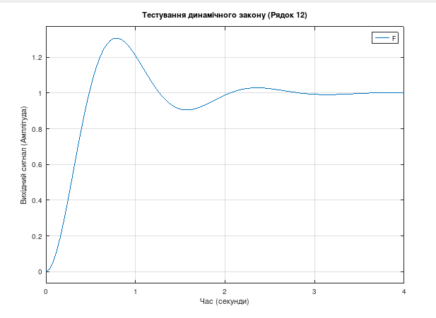

# Довідник із Перетворення Лапласа для Інженерів та Розробників (Control Systems & Signal Processing)

Цей репозиторій містить класичні та просунуті пари перетворень Лапласа, структуровані для математичного моделювання, аналізу стійкості динамічних систем та проектування регуляторів (зокрема ПІД).

## Анатомія $s$-площини та фізичний зміст
Перетворення Лапласа переводить функцію з часової області $f(t)$ у комплексну частотну область $F(s)$, де $s = \sigma + j\omega$. 
* **$\sigma$ (дійсна частина)** відповідає за закон згасання або наростання амплітуди (демпфування).
* **$\omega$ (уявна частина)** відповідає за частоту власних коливань системи.

---

## Основна таблиця перетворень Лапласа

| № | Зображення Лапласа $F(s)$ | Оригінал у часі $f(t)$ | Тип ланки / Сигналу | Опис математичного закону | Фізичний зміст та застосування в інженерії |
| :--- | :--- | :--- | :--- | :--- | :--- |
| **1** | $1$ | $\delta(t)$ | Функція Дірака (Імпульс) | Миттєвий удар нескінченної амплітуди та нульової тривалості з одиничною площею. | **Тест на ударну міцність.** Моделювання різких збурень: удар блискавки в ЛЕП, наїзд колеса на гострий камінь, імпульс тиску в гідравліці. |
| **2** | $\frac{1}{s}$ | $1(t)$ | Функція Гевісайда (Сходинка) | Миттєве увімкнення постійної величини в момент часу $t=0$. | **Тест на увімкнення.** Подача константної напруги на двигун, команда дрону «заняти висоту 10 метрів», стрибкоподібна зміна уставки регулятора. |
| **3** | $\frac{1}{s^2}$ | $t$ | Рампова функція (Лінійно зростаюча) | Сигнал, що збільшується з постійною швидкістю прямо пропорційно часу. | **Тест на стеження.** Імітація безперервного розгону механізму, лінійна зміна кута повороту антени при стеженні за літаком або ракетою. |
| **4** | $\frac{n!}{s^{n+1}}$ | $t^n$ | Степенева функція | Поліноміальне зростання сигналу в часі (прискорення, ривок тощо). | Моделювання динаміки систем із вищими порядками кінематики (наприклад, рух із перемінним прискоренням). |
| **5** | $\frac{1}{s+a}$ | $e^{-at}$ | Аперіодична (інерційна) ланка 1-го порядку | Експоненціальне згасання зі швидкістю, що визначається сталою часу $T = 1/a$. | **Процеси нагрівання та охолодження, заряд конденсатора.** Описує теплову інерцію датчиків, падіння напруги на RC-фільтрі, гальмування корабля через в'язке тертя. |
| **6** | $\frac{a}{s(s+a)}$ | $1 - e^{-at}$ | Розгін інерційної ланки | Плавний вихід системи на стабільний рівень із початковою затримкою. | **Перехідна характеристика реального мотора.** Зростання швидкості вала двигуна постійного струму після подачі живлення з урахуванням його маси та інерції. |
| **7** | $\frac{a}{s^2(s+a)}$ | $\frac{1}{a}(at - 1 + e^{-at})$ | Інтегруюча ланка з уповільненням | Лінійне зростання згладженої форми з експоненціальним відставанням на старті. | **Розгін масивного поїзда.** Описує рух об'єктів із величезною масою, де сила інерції довго не дозволяє вийти на стабільну лінійну швидкість. |
| **8** | $\frac{\omega}{s^2 + \omega^2}$ | $\sin(\omega t)$ | Ідеальна коливальна ланка (Синус) | Гармонічні незатухаючі коливання з круговою частотою $\omega$. | **Генератори сигналів, незатухаючий гул.** Ідеальний маятник без тертя, коливання в LC-контурі без втрат, вібрація незбалансованого ротора. |
| **9** | $\frac{s}{s^2 + \omega^2}$ | $\cos(\omega t)$ | Ідеальна коливальна ланка (Косинус) | Гармонічні коливання, що починаються з максимальної амплітуди в момент $t=0$. | Аналіз гармонічних впливів у механіці та електротехніці при ненульових початкових умовах. |
| **10** | $\frac{\omega}{(s+a)^2 + \omega^2}$ | $e^{-at}\sin(\omega t)$ | Реальна коливальна ланка (Затухаючий синус) | Коливальний процес, амплітуда якого експоненціально прямує до нуля зі швидкістю $a$. | **Автомобільний амортизатор, підвіска.** Поведінка машини при наїзді на перешкоду, коливання струни, перехідні процеси в довгих лініях електропередач. |
| **11** | $\frac{s+a}{(s+a)^2 + \omega^2}$ | $e^{-at}\cos(\omega t)$ | Реальна коливальна ланка (Затухаючий косинус) | Затухаючі гармонічні коливання з фазовим зсувом, що обумовлений початковим відхиленням. | Моделювання динаміки пружних конструкцій (крило літака під впливом вітру, висотна будівля при сейсмічному ударі). |
| **12** | $\frac{a^2 + b^2}{s[(s+a)^2 + b^2]}$ | $1 - e^{-at}\left(\cos bt + \frac{a}{b}\sin bt\right)$ | Коливальна ланка під ступенчевим навантаженням | Вихід на цільовий рівень через серію затухаючих перерегулювань («перелітів»). | **Вихід системи з ПИД-регулятором на уставку.** Типовий графік стабілізації квадрокоптера на заданій висоті або утримання температури промислової печі. |
| **13** | $\frac{1}{s(Ts + 1)}$ | $1 - e^{-t/T}$ | Стандартна форма інерційної ланки | Класичний інженерний запис процесу накопичення енергії в ємності зі сталою часу $T$. | Проектування низькочастотних аналогових та цифрових фільтрів для очищення сигналів від високочастотних шумів. |

---

## Як використовувати цю таблицю для моделювання в ОС Linux (Ubuntu)

Якщо ви проектуєте систему автоматичного керування (САК) і хочете протестувати поведінку одного з цих законів, ви можете використовувати середовище **GNU Octave** або **MATLAB**.

### Приклад скрипту для симуляції рядка №12 (ПІД-перерегулювання):

```octave
% 1. Підключаємо пакет теорії керування (тільки для Octave)
pkg load control

% 2. Оголошуємо оператор Лапласа 's'
s = tf('s');

% 3. Задаємо параметри фізичного закону
a = 1.5; % Коефіцієнт згасання (робота Д-складової)
b = 4.0; % Частота коливань (робота П-складової)

% 4. Записуємо s-модель із таблиці
F = (a^2 + b^2) / ((s + a)^2 + b^2);

% 5. Запускаємо віртуальний тест на увімкнення (подаємо сходинку 1/s автоматично)
step(F);
title('Тестування динамічного закону (Рядок 12)');
xlabel('Час (секунди)');
ylabel('Вихідний сигнал (Амплітуда)');
grid on;
```

**Результат симуляції:**


## Продовження таблиці перетворень Лапласа (Ланки вищих порядків та спецсигнали)

| № | Зображення Лапласа $F(s)$ | Оригінал у часі $f(t)$ | Тип ланки / Сигналу | Опис математичного закону | Фізичний зміст та застосування в інженерії |
| :--- | :--- | :--- | :--- | :--- | :--- |
| **14** | $\frac{1}{s^2(Ts + 1)}$ | $t - T(1 - e^{-t/T})$ | Інтегруюча ланка з аперіодичним запізненням | Лінійне зростання виходу, яке починається не одразу, а згладжено згасає на старті через інерцію. | **Наповнення резервуара газом або рідиною.** Описує зміну рівня рідини, коли помпа розганяється поступово, а не вмикається миттєво. |
| **15** | $\frac{s}{Ts + 1}$ | $\frac{1}{T}e^{-t/T}$ (при $t > 0$) | Реальна диференціююча ланка | Реагує лише на швидкість зміни вхідного сигналу, видаючи імпульс, який швидко згасає. | **Д-складова (реальна) у ПІД-регуляторах.** Використовується для демпфування: реагує на різкий ривок системи (наприклад, порив вітру на дрон) і гасить його. |
| **16** | $\frac{T_1 s + 1}{T_2 s + 1}$ | $\frac{T_1}{T_2}\delta(t) + \frac{T_2 - T_1}{T_2^2}e^{-t/T_2}$ | Форсуюча ланка першого порядку | Створює початковий форсований стрибок амплітуди, після чого система плавно повертається до статичного рівня. | **Компенсатори в системах зв'язку та керування.** Дозволяє штучно «підштовхнути» повільний об'єкт (наприклад, підігрівач), щоб він швидше зреагував на команду. |
| **17** | $\frac{1}{(s+a)^n}$ | $\frac{t^{n-1}}{(n-1)!}e^{-at}$ | Каскад однакових інерційних ланок | Поєднання поліноміального зростання та експоненціального згасання. Дає куполоподібну криву. | **Багатокаскадні хімічні реактори або довгі фільтри.** Описує поширення речовини або тепла через серію послідовних однорідних зон. |
| **18** | $\frac{s}{(s+a)^2 + \omega^2}$ | $\frac{\sqrt{a^2+\omega^2}}{\omega}e^{-at}\sin(\omega t - \phi)$, де $\phi = \arctan(\frac{\omega}{-a})$ | Диференціювання коливального процесу | Затухаючі коливання із початковим зсувом фази, які починаються з нульового положення, але мають крутий початковий нахил. | **Вимірювання швидкості коливань.** Описує сигнал з датчика прискорення (акселерометра) або тахогенератора під час вібраційного удару. |
| **19** | $e^{-s\tau}$ | $\delta(t - \tau)$ | Ідеальне чисте запізнення (Транспортна затримка) | Переносить вхідний сигнал у часі на величину $\tau$ абсолютно без спотворень форми. | **Час польоту сигналу або транспортування.** Час, за який звукова хвиля долітає до мікрофона, або час руху згоряння палива по патрубку ракети. |
| **20** | $\frac{e^{-s\tau}}{Ts + 1}$ | $1 - e^{-(t-\tau)/T}$ (при $t \ge \tau$) | Інерційна ланка з чистим запізненням | Система взагалі не реагує на команду протягом часу $\tau$, а потім починає плавно розганятися. | **Найпоширеніша модель промислових об'єктів.** Передача тепла по довгій трубі: гаряча вода доходить до термометра лише через $\tau$ секунд, і лише тоді датчик починає нагріватися. |
| **21** | $\frac{a^2 + b^2}{s[(s+a)^2 + b^2]}$ | $1 - e^{-at}\left(\cos bt + \frac{a}{b}\sin bt\right)$ | Замкнута коливальна система під одиничним кроком | Повний математичний опис перехідного процесу із класичним перерегулюванням («болтанкою») та виходом на одиничну полицю. | **Аналіз якості ПІД-керування.** Головна формула для перевірки стійкості автопілотів, стабілізаторів напруги та контурів терморегуляції. |

